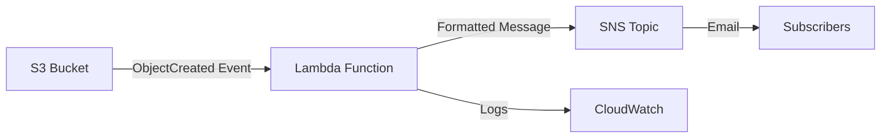

# Design Document: S3 File Upload Notifier

## Overview

The S3 File Upload Notifier is a serverless event-driven system that automatically detects file uploads to an S3 bucket and sends formatted notifications via email. The system uses AWS Lambda for event processing and Amazon SNS for notification delivery, providing a scalable, cost-effective solution for file upload monitoring.

The architecture follows AWS serverless best practices with proper error handling, logging, and least-privilege IAM permissions. All infrastructure is defined as code using AWS SAM (Serverless Application Model) for consistent deployments across environments.

## Architecture

### High-Level Architecture



### Component Interaction Flow

1. **File Upload**: User uploads file to monitored S3 bucket
2. **Event Trigger**: S3 generates ObjectCreated event and invokes Lambda
3. **Event Processing**: Lambda extracts metadata and formats notification
4. **Notification Delivery**: Lambda publishes message to SNS topic
5. **Email Distribution**: SNS delivers email to all subscribers
6. **Logging**: All activities logged to CloudWatch for monitoring

### AWS Services Integration

- **S3**: Event source with bucket notification configuration
- **Lambda**: Event processor with Python 3.12 runtime
- **SNS**: Message distribution service for email notifications
- **CloudWatch**: Centralized logging and monitoring
- **IAM**: Role-based access control with least-privilege permissions

## Components and Interfaces

### S3 Event Source

**Configuration:**
- Event Type: `s3:ObjectCreated:*`
- Filter: All objects (no prefix/suffix filtering)
- Destination: Lambda function ARN

**Event Payload Structure:**
```json
{
  "Records": [
    {
      "eventSource": "aws:s3",
      "eventName": "ObjectCreated:Put",
      "eventTime": "2024-01-01T12:00:00.000Z",
      "awsRegion": "us-east-1",
      "s3": {
        "bucket": {
          "name": "file-uploads-123456789-us-east-1"
        },
        "object": {
          "key": "documents/report.pdf",
          "size": 1048576
        }
      }
    }
  ]
}
```

### Lambda Event Processor

**Function Specification:**
- Runtime: Python 3.12
- Memory: 128 MB
- Timeout: 30 seconds
- Handler: `handler.lambda_handler`

**Core Functions:**

```python
def lambda_handler(event, context) -> dict
def process_s3_record(record) -> dict
def get_content_type(bucket_name, object_key) -> str
def format_file_size(size_bytes) -> str
def send_notification(file_info) -> None
```

**Environment Variables:**
- `SNS_TOPIC_ARN`: Target SNS topic for notifications

**IAM Permissions Required:**
- `s3:GetObject` on source bucket
- `sns:Publish` on notification topic
- `logs:CreateLogGroup`, `logs:CreateLogStream`, `logs:PutLogEvents`

### SNS Notification Service

**Topic Configuration:**
- Topic Name: `file-upload-notifications`
- Display Name: `File Upload Alerts`
- Protocol: Email
- Message Format: Text with structured formatting

**Message Structure:**
- Subject: `📁 New File Upload: {filename}`
- Body: Formatted text with file details, location, and timestamp

## Data Models

### File Metadata Model

```python
@dataclass
class FileMetadata:
    bucket_name: str
    file_name: str
    file_size: int
    file_size_formatted: str
    content_type: str
    event_time: str
    event_type: str
    aws_region: str
```

### Notification Message Model

```python
@dataclass
class NotificationMessage:
    subject: str
    body: str
    topic_arn: str
    
    def validate(self) -> bool:
        return (
            len(self.subject) <= 100 and  # SNS subject limit
            len(self.body) <= 262144 and  # SNS message limit
            self.topic_arn.startswith('arn:aws:sns:')
        )
```

### Lambda Response Model

```python
@dataclass
class ProcessingResponse:
    status_code: int
    processed_files: List[str]
    processed_count: int
    errors: List[str]
```

## Correctness Properties

*A property is a characteristic or behavior that should hold true across all valid executions of a system—essentially, a formal statement about what the system should do. Properties serve as the bridge between human-readable specifications and machine-verifiable correctness guarantees.*

### Property 1: Event Generation for File Uploads
*For any* file uploaded to the monitored S3 bucket, the system should generate exactly one event notification that reaches the Lambda function within the configured timeout period.
**Validates: Requirements 1.1, 1.2**

### Property 2: Complete Metadata Extraction
*For any* valid S3 upload event, the Event_Processor should successfully extract all required metadata fields (file name, size, content type, timestamp) and format them appropriately for notification.
**Validates: Requirements 2.1, 2.2, 2.3, 2.4**

### Property 3: Comprehensive Message Formatting
*For any* file metadata, the Message_Formatter should create a notification message that includes the file name in the subject, properly formatted file size, bucket information, timestamp, and follows the consistent message structure.
**Validates: Requirements 3.1, 3.2, 3.3, 3.4**

### Property 4: SNS Publishing Success
*For any* valid notification message, the Notification_Service should successfully publish it to SNS with both subject and message body, and log the successful delivery with message ID.
**Validates: Requirements 4.1, 4.2, 4.4**

### Property 5: Processing Metrics Accuracy
*For any* batch of S3 events processed in one Lambda invocation, the system should accurately report the count of successfully processed files and any errors encountered.
**Validates: Requirements 5.2, 5.5**

### Property 6: File Size Formatting Consistency
*For any* file size in bytes, the formatting function should convert it to appropriate human-readable units (B, KB, MB, GB, TB) with consistent precision and unit selection.
**Validates: Requirements 3.2**

## Error Handling

### Error Categories and Responses

**Configuration Errors:**
- Missing SNS_TOPIC_ARN environment variable → Fail fast with clear error
- Invalid SNS topic ARN format → Fail fast with validation error

**Runtime Errors:**
- S3 metadata retrieval failure → Log error, continue with available data
- SNS publishing failure → Log error, retry once, then fail
- Malformed S3 events → Log warning, skip invalid records

**Input Validation:**
- Missing required S3 event fields → Skip record with warning
- Invalid file names or paths → Process with sanitized names
- Zero-byte files → Process normally (valid use case)

### Retry Strategy

- **SNS Publishing**: Single retry on failure with exponential backoff
- **S3 Metadata Retrieval**: No retry (fail fast to avoid timeout)
- **Event Processing**: Continue processing remaining events on individual failures

### Logging Standards

**Success Logs:**
```
INFO: Successfully processed: filename.txt
INFO: SNS notification sent. MessageId: 12345-abcd-6789
INFO: Lambda response: {"statusCode": 200, "processed_count": 3}
```

**Error Logs:**
```
ERROR: SNS_TOPIC_ARN environment variable not set
WARNING: Could not get content type: AccessDenied
ERROR: Failed to send SNS notification: InvalidTopicArn
```

## Testing Strategy

### Dual Testing Approach

The system will use both unit testing and property-based testing for comprehensive coverage:

**Unit Tests:**
- Specific examples demonstrating correct behavior
- Edge cases and error conditions
- Integration points between components
- Mock AWS services for isolated testing

**Property-Based Tests:**
- Universal properties verified across randomized inputs
- Comprehensive input coverage through generation
- Each property test runs minimum 100 iterations
- Tests tagged with feature and property references

### Property-Based Testing Configuration

**Testing Framework:** `hypothesis` for Python property-based testing
**Test Configuration:**
- Minimum 100 iterations per property test
- Custom generators for S3 events, file metadata, and message formats
- Shrinking enabled for minimal counterexamples

**Test Tagging Format:**
```python
# Feature: s3-upload-notifier, Property 1: Event Generation for File Uploads
def test_event_generation_property():
    # Property test implementation
```

### Test Data Generation

**S3 Event Generator:**
- Random bucket names, object keys, file sizes
- Various content types and timestamps
- Edge cases: empty files, long filenames, special characters

**File Metadata Generator:**
- File sizes from 0 bytes to multiple GB
- Various content types (text, binary, unknown)
- Different timestamp formats and timezones

**Message Content Generator:**
- Various filename lengths and character sets
- Different file size ranges for unit testing
- Subject line length variations for SNS limits

### Integration Testing

**AWS Service Integration:**
- Test with actual S3 events (not just mocked)
- Verify SNS message delivery to test topics
- CloudWatch log verification for monitoring

**End-to-End Validation:**
- Upload test files to S3 bucket
- Verify Lambda invocation and processing
- Confirm email delivery to test subscribers
- Validate message content and formatting

This testing strategy ensures both specific behavior validation through unit tests and general correctness verification through property-based testing, providing comprehensive coverage of the system's functionality.